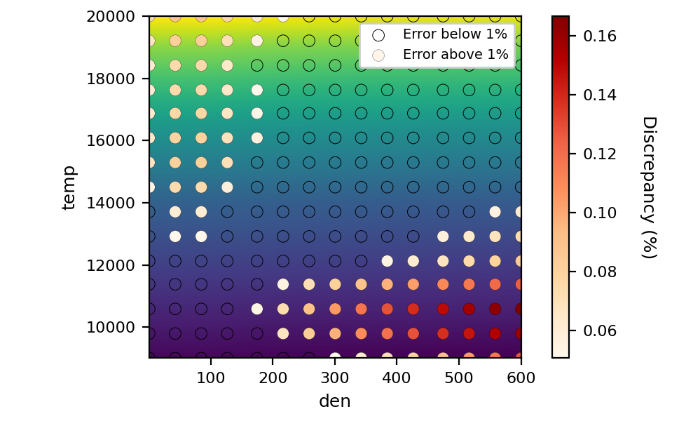

API
===

:math:`\textsc{INNATE}` features a composite software design, utilizing instances of other classes to implement the target
functionality. The image below shows a basic diagram with the library structure:

The next sections detail the functions attributes and their outputs:

Inputs/outputs
--------------

.. autofunction:: innate.io.load_dataset

.. autofunction:: innate.io.save_dataset

Core objects
------------

.. autoclass:: innate.Grid

.. autoclass:: innate.DataSet

.. autofunction:: innate.DataSet.from_file

Interpolation techniques
------------------------

.. autofunction:: innate.interpolation.pytensor.regular_grid_interp

Regression techniques
---------------------

.. autofunction:: innate.regression.methods.parse_string_equation

Plots
-----

.. autofunction:: innate.plotting.Plotter.matrix_diagnostic

